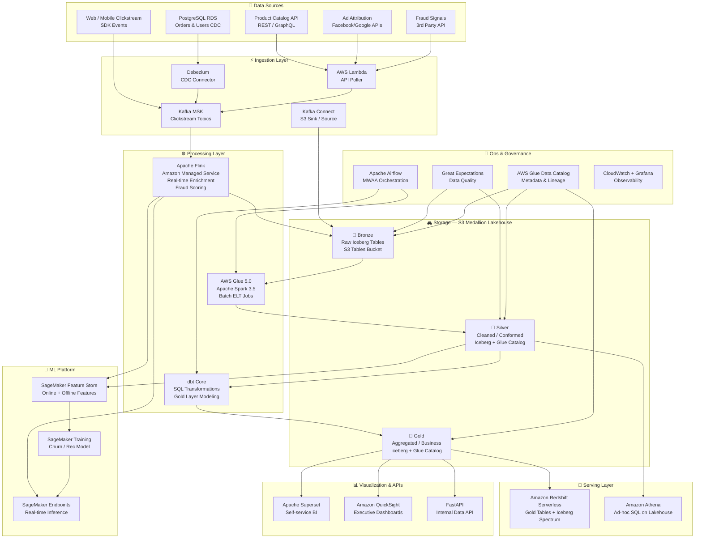

# 🛒 PulseCommerce — Real-Time E-Commerce Behavioral Analytics Platform

> **A production-grade, end-to-end Big Data Lakehouse on AWS**  
> Stack: Kafka · Apache Flink · Apache Iceberg · AWS Glue · S3 Tables · Redshift Serverless · dbt · Apache Airflow · Great Expectations · Apache Superset · SageMaker  
> Architecture: Kappa + Medallion Lakehouse · ELT · Event-Driven

---

## Table of Contents

1. [Problem Statement](#1-problem-statement)
2. [Why Big Data?](#2-why-big-data)
3. [Architecture Overview](#3-architecture-overview)
4. [Data Sources](#4-data-sources)
5. [Ingestion Layer](#5-ingestion-layer)
6. [Storage Layer — Medallion Lakehouse](#6-storage-layer--medallion-lakehouse)
7. [Processing Layer](#7-processing-layer)
8. [Data Pipeline — End to End](#8-data-pipeline--end-to-end)
9. [Cloud Architecture (AWS)](#9-cloud-architecture-aws)
10. [Data Modeling](#10-data-modeling)
11. [Data Quality & Observability](#11-data-quality--observability)
12. [Scalability & Performance](#12-scalability--performance)
13. [CI/CD & Deployment](#13-cicd--deployment)
14. [Cost Optimization](#14-cost-optimization)
15. [Security & Governance](#15-security--governance)
16. [Serving & Visualization Layer](#16-serving--visualization-layer)
17. [ML Extension — Real-Time Churn & Recommendation Engine](#17-ml-extension--real-time-churn--recommendation-engine)
18. [Tech Stack Justification](#18-tech-stack-justification)
19. [Project Folder Structure](#19-project-folder-structure)
20. [Future Improvements & Known Failure Points](#20-future-improvements--known-failure-points)
21. [Architecture Decision Records (ADRs)](#21-architecture-decision-records-adrs)

---

## 1. Problem Statement

A mid-to-large e-commerce company — **PulseCommerce** — operates across 14 countries with 4M+ daily active users. Their existing data stack is a fragmented mess:

- **Transactional DB (RDS PostgreSQL)** captures orders, but analytics queries are killing production performance.
- **Click events** are dumped to S3 as raw JSON with no schema enforcement — files pile up in a "data swamp."
- **Marketing teams** wait 24 hours for daily batch reports to make campaign decisions.
- **Fraud losses** total ~$2.3M/quarter due to no real-time behavioral detection.
- **Recommendation engine** relies on weekly batch retraining, causing staleness and a measurable 7% drop in CTR.

**Goal:** Build a unified, real-time behavioral analytics platform that can:
- Detect anomalous purchase patterns in under 500ms
- Power personalized recommendations updated hourly
- Provide self-service BI for marketing, finance, and ops teams
- Enable ML teams to train models on fresh feature data without custom pipelines

---

## 2. Why Big Data?

| Dimension | Scale | Challenge |
|---|---|---|
| **Volume** | ~120GB of clickstream/day, 15TB historical | Cannot fit in a single RDBMS; requires distributed storage |
| **Velocity** | 80,000 events/second at peak (flash sales) | Batch ETL latency is unacceptable; streaming required |
| **Variety** | JSON click events, CSV product feeds, DB CDC, mobile SDK logs, ad attribution payloads | Heterogeneous schemas require a flexible lakehouse approach |
| **Veracity** | Bot traffic, duplicate events, late-arriving mobile data | Data quality enforcement at ingestion and processing layers |
| **Value** | Churn prediction, fraud signals, product affinity | ML workloads require feature freshness unavailable in batch |

A conventional RDBMS + nightly ETL pattern cannot satisfy sub-second fraud signals, hourly model retraining, or petabyte-scale historical analysis simultaneously. This demands a **streaming-first Kappa architecture** layered on a **Medallion Lakehouse**.

---

## 3. Architecture Overview

### 3.1 High-Level Architecture Diagram



### 3.2 Architecture Pattern — Kappa + Medallion Lakehouse

This platform uses a **Kappa architecture** (stream-everything, reprocess via replay) rather than Lambda (dual batch + stream paths), combined with a **Medallion Lakehouse** (Bronze → Silver → Gold) on Apache Iceberg + AWS S3 Tables.

**Why Kappa over Lambda here?**

| | Lambda | Kappa (chosen) |
|---|---|---|
| Complexity | Two separate codebases (batch + stream) | Single streaming path, simpler ops |
| Latency | Batch layer adds hours of lag | Sub-second for streaming layer |
| Reprocessing | Requires reconciliation logic | Replay Kafka topic from offset 0 |
| Use case fit | Better for heavy, irregular batch workloads | Better for high-velocity, event-driven platforms |

The trade-off: Kappa requires a robust message broker with long retention (we configure MSK with 7-day retention + S3 offload) and a stateful stream processor (Flink) capable of handling reprocessing at scale.

---

## 4. Data Sources

### 4.1 Source Inventory

| Source | Type | Format | Volume | Latency Class |
|---|---|---|---|---|
| Web/Mobile SDK (Segment-compatible) | Event Stream | JSON | 80K events/sec peak | Real-time |
| PostgreSQL RDS (orders, users, payments) | CDC | Avro (Debezium) | ~50K mutations/hour | Near real-time |
| Product Catalog Service | REST API | JSON | 5K records/day | Micro-batch (15 min) |
| Ad Attribution (Facebook/Google) | Batch API | JSON | 2M rows/day | Daily batch |
| Third-party Fraud API (Sift/Sardine) | Webhook + Pull | JSON | Per transaction | Real-time |

### 4.2 Event Schema — Clickstream (Canonical)

```json
{
  "event_id": "uuid-v4",
  "user_id": "usr_8x72hq",
  "session_id": "sess_ab12cd",
  "event_type": "product_view | add_to_cart | checkout_start | purchase | search",
  "timestamp": "2025-11-14T08:42:31.412Z",
  "device": { "type": "mobile", "os": "iOS", "app_version": "4.2.1" },
  "page": { "url": "/product/shoe-sku-001", "referrer": "search" },
  "product": { "sku": "shoe-sku-001", "category": "footwear", "price_usd": 89.99 },
  "geo": { "country": "KE", "city": "Nairobi", "timezone": "Africa/Nairobi" },
  "flags": { "is_bot": false, "ab_cohort": "exp_checkout_v3" }
}
```

---

## 5. Ingestion Layer

### 5.1 Architecture Decision — MSK vs Kinesis

We use **Amazon MSK (Managed Streaming for Kafka)** over Kinesis for the following reasons:

| Factor | MSK (Kafka) | Kinesis |
|---|---|---|
| Replay / retention | 7 days + S3 Tiered Storage (unlimited) | 365 days max, expensive |
| Ecosystem | 180+ Kafka Connect connectors, Flink native | Limited connector ecosystem |
| Flink integration | Native Flink-Kafka source/sink | Requires custom connector |
| Schema Registry | Confluent Schema Registry on MSK | AWS Glue Schema Registry only |
| Ops complexity | Higher (broker management) | Fully managed, serverless |

Trade-off: MSK requires more operational investment. We mitigate this with MSK Serverless for dev/staging and provisioned MSK clusters (3-broker, `kafka.m5.2xlarge`) for production, auto-scaled via CloudWatch metrics.

### 5.2 Kafka Topic Design

```
Topic Naming Convention: {environment}.{domain}.{entity}.{version}

prod.ecommerce.clickstream.v1        -- partitions: 24, retention: 7d
prod.ecommerce.orders.cdc.v1         -- partitions: 12, retention: 7d  
prod.ecommerce.fraud-signals.v1      -- partitions: 6,  retention: 3d
prod.ecommerce.product-catalog.v1    -- partitions: 6,  retention: 7d
prod.ecommerce.enriched-events.v1    -- partitions: 24, retention: 3d (Flink output)
```

**Partitioning key:** `user_id` for clickstream (co-locates a user's events on the same partition, enabling stateful session windowing in Flink).

### 5.3 CDC with Debezium

PostgreSQL logical replication → Debezium Kafka Connect → MSK:

```json
// Debezium connector config (orders table)
{
  "name": "postgres-orders-cdc",
  "config": {
    "connector.class": "io.debezium.connector.postgresql.PostgresConnector",
    "database.hostname": "orders-db.cluster.rds.amazonaws.com",
    "database.port": "5432",
    "database.dbname": "pulsecommerce",
    "table.include.list": "public.orders,public.order_items,public.users",
    "plugin.name": "pgoutput",
    "publication.name": "debezium_pub",
    "slot.name": "debezium_orders_slot",
    "transforms": "unwrap",
    "transforms.unwrap.type": "io.debezium.transforms.ExtractNewRecordState",
    "transforms.unwrap.add.fields": "op,ts_ms,source.ts_ms",
    "key.converter": "io.confluent.kafka.serializers.KafkaAvroSerializer",
    "value.converter": "io.confluent.kafka.serializers.KafkaAvroSerializer",
    "schema.registry.url": "http://schema-registry.internal:8081"
  }
}
```

**Schema Registry** (Confluent Schema Registry on EC2 within the VPC) enforces Avro schemas with forward/backward compatibility. Every schema change goes through a PR-gated compatibility check — a `BACKWARD` compatibility mode means new consumers can always read old data.

### 5.4 Batch Ingestion (Ad Attribution)

AWS Lambda (scheduled via EventBridge, daily 02:00 UTC) pulls the Facebook Marketing API and Google Ads API, normalizes responses into the canonical JSON format, and produces to `prod.ecommerce.ad-attribution.v1`. This micro-service pattern avoids a heavy orchestration dependency for simple API polling.

```python
# ingestion/batch/ad_attribution_producer.py
import boto3, json, time
from kafka import KafkaProducer
from sources.facebook import fetch_facebook_attribution
from sources.google import fetch_google_attribution

producer = KafkaProducer(
    bootstrap_servers=os.environ["MSK_BROKERS"],
    value_serializer=lambda v: json.dumps(v).encode("utf-8"),
    compression_type="lz4",
    batch_size=65536,        # 64KB batching for throughput
    linger_ms=100,           # Wait 100ms to fill batches
    acks="all",              # Full durability guarantee
    retries=5
)

def normalize_and_produce(records: list[dict], topic: str):
    for record in records:
        producer.send(topic, value=record, key=record["campaign_id"].encode())
    producer.flush()
```

---

## 6. Storage Layer — Medallion Lakehouse

### 6.1 AWS S3 Tables + Apache Iceberg

We use **AWS S3 Tables** (GA since re:Invent 2024) as our primary lakehouse storage. S3 Tables provide built-in Apache Iceberg support with automatic compaction, snapshot expiry, and unreferenced file cleanup — eliminating the need for custom maintenance jobs that historically cost 0.5 FTE of engineering time.

```
S3 Table Bucket Structure:
s3://pulsecommerce-lakehouse-{account_id}/
├── bronze/
│   ├── clickstream/           (Iceberg table, partitioned by event_date/hour)
│   ├── orders_cdc/            (Iceberg table, partitioned by op_date)
│   └── ad_attribution_raw/    (Iceberg table, partitioned by report_date)
├── silver/
│   ├── user_sessions/         (Iceberg, partitioned by session_date)
│   ├── enriched_events/       (Iceberg, partitioned by event_date)
│   ├── orders_unified/        (Iceberg, SCD Type 2, partitioned by updated_date)
│   └── product_catalog/       (Iceberg, partitioned by category)
└── gold/
    ├── fct_orders/            (Iceberg, partitioned by order_date)
    ├── fct_sessions/          (Iceberg, partitioned by session_date)
    ├── dim_users/             (Iceberg, full refresh)
    ├── dim_products/          (Iceberg, full refresh)
    └── agg_daily_metrics/     (Iceberg, partitioned by metric_date)
```

### 6.2 Iceberg Table Configuration (Bronze Clickstream)

```sql
-- AWS Glue / Spark SQL: Create Iceberg table in S3 Tables bucket
CREATE TABLE glue_catalog.bronze.clickstream (
    event_id        STRING,
    user_id         STRING,
    session_id      STRING,
    event_type      STRING,
    event_ts        TIMESTAMP,
    device          STRUCT<type: STRING, os: STRING, app_version: STRING>,
    product         STRUCT<sku: STRING, category: STRING, price_usd: DOUBLE>,
    geo             STRUCT<country: STRING, city: STRING, timezone: STRING>,
    flags           STRUCT<is_bot: BOOLEAN, ab_cohort: STRING>,
    raw_payload     STRING,   -- original JSON preserved for reprocessing
    ingested_at     TIMESTAMP,
    event_date      DATE,     -- partition column (hidden partition)
    event_hour      INT       -- partition column
)
PARTITIONED BY (event_date, event_hour)
TBLPROPERTIES (
    'table_type'                      = 'ICEBERG',
    'format-version'                  = '2',
    'write.target-file-size-bytes'    = '134217728',   -- 128MB target
    'write.distribution-mode'         = 'hash',
    'history.expire.max-snapshot-age-ms' = '604800000', -- 7 days
    'read.split.target-size'          = '134217728'
);
```

### 6.3 Medallion Layer Definitions

| Zone | Contents | SLA | Format | Engine |
|---|---|---|---|---|
| **Bronze** | Raw, immutable, schema-validated only | Written within 30s of Kafka offset | Iceberg + Parquet | Flink (streaming write) |
| **Silver** | Deduplicated, conformed types, joined w/ reference data, PII masked | Updated every 15 min | Iceberg + Parquet | Glue Spark (micro-batch) |
| **Gold** | Business-level aggregations, dimensional models, ML-ready features | Updated every 1 hour | Iceberg + Parquet | dbt + Glue Spark |

### 6.4 Schema Evolution Strategy

Apache Iceberg handles schema evolution as a **metadata-only operation** — no data rewrite required:

```python
# processing/schema/evolve_clickstream.py
from pyiceberg.catalog import load_catalog

catalog = load_catalog("glue", **{"type": "glue", "warehouse": "s3://pulsecommerce-lakehouse/"})
table = catalog.load_table("bronze.clickstream")

# Add new column (safe: backward compatible)
with table.update_schema() as update:
    update.add_column("user_agent", StringType(), doc="Raw UA string added in v2")

# Iceberg tracks columns by ID, not name — renaming is safe
with table.update_schema() as update:
    update.rename_column("flags.is_bot", "flags.bot_detected")
```

**Compatibility rules enforced in Schema Registry:**
- Bronze → `NONE` (raw source, schema may change)
- Silver → `BACKWARD` (new consumers can read old data)
- Gold → `FULL` (bidirectional compatibility, stable contract for BI tools)

---

## 7. Processing Layer

### 7.1 Apache Flink — Real-Time Stream Processing

**Amazon Managed Service for Apache Flink** (Flink 1.19) runs three critical streaming jobs:

#### Job 1: Bronze Writer (Clickstream → Bronze Iceberg)

```python
# processing/flink/bronze_writer.py
from pyflink.datastream import StreamExecutionEnvironment
from pyflink.table import StreamTableEnvironment

env = StreamExecutionEnvironment.get_execution_environment()
env.set_parallelism(24)                        # matches Kafka partition count
env.get_checkpoint_config().set_checkpointing_interval(60_000)   # 60s checkpoints
env.get_checkpoint_config().set_min_pause_between_checkpoints(30_000)

t_env = StreamTableEnvironment.create(env)

# Source: MSK Kafka
t_env.execute_sql("""
    CREATE TABLE kafka_clickstream (
        event_id     STRING,
        user_id      STRING,
        session_id   STRING,
        event_type   STRING,
        `timestamp`  STRING,
        device       ROW<type STRING, os STRING, app_version STRING>,
        product      ROW<sku STRING, category STRING, price_usd DOUBLE>,
        geo          ROW<country STRING, city STRING, timezone STRING>,
        flags        ROW<is_bot BOOLEAN, ab_cohort STRING>,
        kafka_ts     TIMESTAMP(3) METADATA FROM 'timestamp',
        WATERMARK FOR kafka_ts AS kafka_ts - INTERVAL '10' SECOND
    ) WITH (
        'connector'                     = 'kafka',
        'topic'                         = 'prod.ecommerce.clickstream.v1',
        'properties.bootstrap.servers'  = '${MSK_BROKERS}',
        'properties.group.id'           = 'flink-bronze-writer',
        'scan.startup.mode'             = 'latest-offset',
        'format'                        = 'json',
        'json.fail-on-missing-field'    = 'false',
        'json.ignore-parse-errors'      = 'true'
    )
""")

# Sink: Bronze Iceberg (S3 Tables via Glue Catalog)
t_env.execute_sql("""
    CREATE TABLE iceberg_bronze_clickstream (
        event_id     STRING,
        user_id      STRING,
        session_id   STRING,
        event_type   STRING,
        event_ts     TIMESTAMP(3),
        ingested_at  TIMESTAMP(3),
        event_date   DATE,
        event_hour   INT,
        PRIMARY KEY (event_id) NOT ENFORCED
    ) PARTITIONED BY (event_date, event_hour)
    WITH (
        'connector'            = 'iceberg',
        'catalog-name'         = 'glue_catalog',
        'catalog-type'         = 'glue',
        'database-name'        = 'bronze',
        'table-name'           = 'clickstream',
        'warehouse'            = 's3://pulsecommerce-lakehouse-123456789/',
        'write.upsert.enabled' = 'true',
        'write.format.default' = 'parquet'
    )
""")

# Transform and write
t_env.execute_sql("""
    INSERT INTO iceberg_bronze_clickstream
    SELECT
        event_id,
        user_id,
        session_id,
        event_type,
        TO_TIMESTAMP(`timestamp`, 'yyyy-MM-dd''T''HH:mm:ss.SSS''Z''') AS event_ts,
        CURRENT_TIMESTAMP AS ingested_at,
        CAST(TO_TIMESTAMP(`timestamp`, 'yyyy-MM-dd''T''HH:mm:ss.SSS''Z''') AS DATE) AS event_date,
        HOUR(TO_TIMESTAMP(`timestamp`, 'yyyy-MM-dd''T''HH:mm:ss.SSS''Z''')) AS event_hour
    FROM kafka_clickstream
    WHERE event_id IS NOT NULL AND user_id IS NOT NULL
""")
```

#### Job 2: Real-Time Fraud Scoring (Session Enrichment + Anomaly)

```python
# processing/flink/fraud_scorer.py
# Pattern: Keyed Process Function with RocksDB state backend
from pyflink.datastream import StreamExecutionEnvironment, KeyedProcessFunction
from pyflink.datastream.state import ValueStateDescriptor
from pyflink.common.typeinfo import Types

class FraudScoringFunction(KeyedProcessFunction):
    """
    Stateful function keyed by user_id.
    Maintains a rolling 15-minute window of events per user.
    Flags anomalies: velocity > 20 events/min, geo-hop, unusual hour.
    """

    def open(self, runtime_context):
        self.event_count_state = runtime_context.get_state(
            ValueStateDescriptor("event_count_15m", Types.INT())
        )
        self.last_country_state = runtime_context.get_state(
            ValueStateDescriptor("last_country", Types.STRING())
        )
        self.last_event_ts_state = runtime_context.get_state(
            ValueStateDescriptor("last_event_ts", Types.LONG())
        )

    def process_element(self, event, ctx):
        current_count = self.event_count_state.value() or 0
        last_country = self.last_country_state.value()
        last_ts = self.last_event_ts_state.value() or 0

        current_ts = event["event_ts_ms"]
        time_delta_seconds = (current_ts - last_ts) / 1000

        fraud_score = 0.0
        fraud_signals = []

        # Signal 1: Event velocity spike
        if current_count > 20 and time_delta_seconds < 60:
            fraud_score += 0.4
            fraud_signals.append("VELOCITY_SPIKE")

        # Signal 2: Geo-hop (country change mid-session)
        if last_country and last_country != event["geo"]["country"]:
            fraud_score += 0.5
            fraud_signals.append("GEO_HOP")

        # Signal 3: Unusual checkout hour (02:00-04:00 local)
        local_hour = (current_ts // 3600000) % 24
        if event["event_type"] == "purchase" and local_hour in range(2, 4):
            fraud_score += 0.2
            fraud_signals.append("UNUSUAL_HOUR")

        # Update state
        self.event_count_state.update(current_count + 1)
        self.last_country_state.update(event["geo"]["country"])
        self.last_event_ts_state.update(current_ts)

        # Register cleanup timer (15 min)
        ctx.timer_service().register_processing_time_timer(current_ts + 900_000)

        yield {**event, "fraud_score": fraud_score, "fraud_signals": fraud_signals}

    def on_timer(self, timestamp, ctx):
        self.event_count_state.clear()   # reset window counter
```

#### Job 3: Session Stitching (15-minute inactivity gap)

Flink session windows group events by `user_id` with a 15-minute inactivity gap, computing session-level metrics (page depth, total_value, funnel stage reached) and emitting to `prod.ecommerce.enriched-events.v1` and the Silver Iceberg layer simultaneously.

### 7.2 AWS Glue 5.0 — Batch ELT (Bronze → Silver)

```python
# processing/glue/bronze_to_silver_events.py
import sys
from awsglue.transforms import *
from awsglue.utils import getResolvedOptions
from pyspark.context import SparkContext
from awsglue.context import GlueContext
from awsglue.job import Job
from pyspark.sql import functions as F
from pyspark.sql.window import Window

sc = SparkContext()
glueContext = GlueContext(sc)
spark = glueContext.spark_session

# Enable Iceberg + Glue Catalog integration
spark.conf.set("spark.sql.extensions",
    "org.apache.iceberg.spark.extensions.IcebergSparkSessionExtensions")
spark.conf.set("spark.sql.catalog.glue_catalog", 
    "org.apache.iceberg.spark.SparkCatalog")
spark.conf.set("spark.sql.catalog.glue_catalog.catalog-impl",
    "org.apache.iceberg.aws.glue.GlueCatalog")
spark.conf.set("spark.sql.catalog.glue_catalog.warehouse",
    "s3://pulsecommerce-lakehouse-123456789/")

# Incremental read using Iceberg snapshots (avoid full table scan)
bronze_df = spark.read.format("iceberg") \
    .option("start-snapshot-id", get_last_processed_snapshot_id()) \
    .table("glue_catalog.bronze.clickstream")

# Deduplication: keep latest record per event_id (Flink at-least-once delivery)
window_spec = Window.partitionBy("event_id").orderBy(F.desc("ingested_at"))
deduped_df = bronze_df \
    .withColumn("rn", F.row_number().over(window_spec)) \
    .filter(F.col("rn") == 1) \
    .drop("rn")

# PII masking (GDPR/PDPA compliance)
silver_df = deduped_df \
    .withColumn("user_id_hashed",
        F.sha2(F.concat(F.col("user_id"), F.lit(os.environ["PII_SALT"])), 256)) \
    .withColumn("geo_city_masked",
        F.when(F.col("geo.country").isin(["EU", "UK"]), F.lit("MASKED"))
         .otherwise(F.col("geo.city"))) \
    .withColumn("bot_filtered",
        F.col("flags.is_bot") == False) \
    .filter(F.col("bot_filtered")) \
    .drop("raw_payload", "flags")   # remove raw payload from Silver+

# Merge into Silver Iceberg (UPSERT — handles late-arriving CDC)
silver_df.createOrReplaceTempView("silver_updates")

spark.sql("""
    MERGE INTO glue_catalog.silver.enriched_events AS target
    USING silver_updates AS source
    ON target.event_id = source.event_id
    WHEN MATCHED AND source.ingested_at > target.ingested_at THEN UPDATE SET *
    WHEN NOT MATCHED THEN INSERT *
""")
```

### 7.3 dbt Core — Gold Layer SQL Transformations

dbt runs inside an AWS Glue job (dbt-glue adapter) with Spark as the execution engine:

```sql
-- analytics/dbt/models/gold/fct_orders.sql
{{
    config(
        materialized   = 'incremental',
        incremental_strategy = 'merge',
        unique_key     = 'order_id',
        file_format    = 'iceberg',
        partition_by   = [{'field': 'order_date', 'data_type': 'date'}],
        on_schema_change = 'sync_all_columns'
    )
}}

WITH orders AS (
    SELECT *
    FROM {{ ref('silver_orders_unified') }}
    
        WHERE updated_at > (SELECT MAX(updated_at) FROM {{ this }})
    
),

order_items AS (
    SELECT * FROM {{ ref('silver_order_items') }}
),

user_sessions AS (
    SELECT user_id_hashed, session_id, session_start_ts, funnel_stage_reached
    FROM {{ ref('silver_user_sessions') }}
),

enriched AS (
    SELECT
        o.order_id,
        o.user_id_hashed,
        o.status,
        o.currency,
        o.total_amount_usd,
        o.item_count,
        o.created_at,
        o.updated_at,
        o.created_at::DATE                          AS order_date,
        s.session_id                                AS attributed_session_id,
        s.funnel_stage_reached,
        DATEDIFF(o.created_at, o.first_cart_at)     AS days_consideration,
        CASE
            WHEN o.total_amount_usd >= 200 THEN 'high_value'
            WHEN o.total_amount_usd >= 50  THEN 'mid_value'
            ELSE 'low_value'
        END AS order_tier
    FROM orders o
    LEFT JOIN user_sessions s
        ON o.user_id_hashed = s.user_id_hashed
        AND o.created_at BETWEEN s.session_start_ts AND s.session_start_ts + INTERVAL 30 MINUTES
)

SELECT * FROM enriched
```

---

## 8. Data Pipeline — End to End

### 8.1 Full Data Flow Walkthrough

```
Step 1  — EVENT EMISSION
         User taps "Add to Cart" on iOS app → SDK fires JSON event to
         REST endpoint → API Gateway → Kinesis Firehose → MSK topic
         prod.ecommerce.clickstream.v1 [partition: user_id hash % 24]
         Latency: ~80ms

Step 2  — FLINK BRONZE WRITE
         Flink Bronze Writer job consumes from MSK.
         Validates schema (not-null: event_id, user_id, event_ts).
         Writes to Iceberg Bronze layer in S3 Tables.
         Iceberg commit interval: 60 seconds (checkpoint-driven).
         Latency from event emission to Bronze commit: ~90s

Step 3  — FLINK FRAUD SCORING (parallel to Step 2)
         Fraud Scorer job enriches every event with fraud_score.
         High-risk events (score > 0.7) emitted to SNS → Lambda →
         Order Service to block transaction.
         Latency: ~200ms end-to-end for block signal.

Step 4  — GLUE SILVER JOB (15-min micro-batch)
         Reads Bronze incrementally via Iceberg snapshot diff.
         Deduplicates, masks PII, filters bots, enriches with
         product catalog lookup.
         Merges into Silver Iceberg tables.
         Latency: Bronze commit to Silver availability: ~15-20 min

Step 5  — DBT GOLD MODELS (hourly, Airflow-orchestrated)
         dbt runs fct_orders, fct_sessions, dim_users, dim_products,
         agg_daily_metrics as incremental Iceberg merges.
         Latency: Silver to Gold: ~10-15 min

Step 6  — REDSHIFT SPECTRUM REFRESH
         Redshift Serverless auto-discovers new Iceberg snapshots via
         Glue Data Catalog. No COPY needed — external Iceberg tables
         via Spectrum are always fresh.
         Latency: near-instant after Gold commit

Step 7  — BI TOOL QUERY
         Superset / QuickSight query Redshift for dashboards.
         Athena used for ad-hoc analysis directly on Silver/Gold.
         P95 query latency: <3s for dashboards, <30s for ad-hoc.
```

### 8.2 Late-Arriving Data Handling

Mobile events can arrive up to 4 hours late (offline → reconnect scenario). Iceberg's **MERGE** semantics and Flink's **event-time watermarks** handle this cleanly:

```python
# Flink watermark strategy: allow 4h late events
WatermarkStrategy \
    .for_bounded_out_of_orderness(Duration.of_hours(4)) \
    .with_timestamp_assigner(lambda event, _: event["event_ts_ms"])
```

For the batch Silver layer, incremental reads using Iceberg snapshot IDs mean the Glue job naturally picks up any late-arriving Bronze records on its next execution cycle without a full backfill.

---

## 9. Cloud Architecture (AWS)

### 9.1 Service Map

| Layer | AWS Service | Configuration |
|---|---|---|
| Ingestion (streaming) | Amazon MSK Serverless + Provisioned | 3-broker, `kafka.m5.2xlarge`, Multi-AZ |
| CDC | Debezium on EKS (t3.medium pods) | Kafka Connect, MSK sink |
| Stream Processing | Amazon Managed Service for Apache Flink | 10 KPUs baseline, autoscale to 50 |
| Batch ELT | AWS Glue 5.0 (Spark 3.5, Python 3.11) | G.2X workers, autoscale 5–30 workers |
| Object Storage | Amazon S3 + S3 Tables | S3 Standard → S3 Standard-IA (lifecycle 90d) |
| Table Catalog | AWS Glue Data Catalog | Unified catalog for all Iceberg tables |
| Data Warehouse | Amazon Redshift Serverless | 128 RPU base, scales to 512 |
| Ad-hoc SQL | Amazon Athena v3 (ICEBERG) | Per-query pricing, Iceberg-native |
| Orchestration | Amazon MWAA (Managed Airflow 2.8) | m5.xlarge environment |
| ML Platform | Amazon SageMaker | Feature Store + Training + Endpoints |
| Schema Registry | Confluent Schema Registry (EC2) | m5.large, multi-AZ with EBS |
| Secrets | AWS Secrets Manager | MSK creds, DB passwords, API keys |
| Monitoring | CloudWatch + Amazon Managed Grafana | Custom dashboards, PagerDuty alerts |
| Networking | VPC (3 AZ), PrivateLink | No data traverses public internet |

### 9.2 VPC & Network Design

```
VPC: 10.0.0.0/16

Private Subnets (data plane):
  10.0.1.0/24 — AZ-a  (MSK brokers, Flink, Glue ENIs)
  10.0.2.0/24 — AZ-b
  10.0.3.0/24 — AZ-c

Public Subnets (NAT, ALB only):
  10.0.101.0/24 — AZ-a
  10.0.102.0/24 — AZ-b

VPC Endpoints (PrivateLink — no NAT for data):
  - com.amazonaws.{region}.s3           (Gateway endpoint, free)
  - com.amazonaws.{region}.glue         (Interface endpoint)
  - com.amazonaws.{region}.redshift-serverless
  - com.amazonaws.{region}.secretsmanager
  - com.amazonaws.{region}.monitoring

Security Groups:
  sg-msk:      inbound 9092, 9094 from sg-flink, sg-connect, sg-glue
  sg-flink:    outbound to sg-msk, S3 VPC endpoint
  sg-glue:     outbound to sg-msk, S3 VPC endpoint, sg-redshift
  sg-redshift: inbound 5439 from sg-glue, sg-superset, sg-airflow
```

### 9.3 IAM Role Design (Least-Privilege)

```json
// Role: pulsecommerce-flink-role
{
    "Statement": [
        {
            "Sid": "S3LakehouseWrite",
            "Effect": "Allow",
            "Action": ["s3:PutObject", "s3:GetObject", "s3:DeleteObject", "s3:ListBucket"],
            "Resource": [
                "arn:aws:s3:::pulsecommerce-lakehouse-*",
                "arn:aws:s3:::pulsecommerce-lakehouse-*/*"
            ]
        },
        {
            "Sid": "GlueCatalogRead",
            "Effect": "Allow",
            "Action": ["glue:GetTable", "glue:GetDatabase", "glue:UpdateTable"],
            "Resource": "arn:aws:glue:*:*:catalog"
        },
        {
            "Sid": "MSKConsume",
            "Effect": "Allow",
            "Action": ["kafka-cluster:Connect", "kafka-cluster:ReadData"],
            "Resource": "arn:aws:kafka:*:*:cluster/pulsecommerce-*/*"
        }
    ]
}
```

---

## 10. Data Modeling

### 10.1 Gold Layer — Star Schema

The Gold layer follows a **Kimball-style star schema** optimized for Redshift Serverless + Iceberg Spectrum query patterns.

```
                         ┌─────────────────┐
                         │   dim_date      │
                         │  date_key PK    │
                         │  year, quarter  │
                         │  month, week    │
                         │  day_of_week    │
                         └────────┬────────┘
                                  │
         ┌────────────────────────┼──────────────────────────┐
         │                        │                          │
┌────────┴────────┐    ┌──────────┴──────────┐   ┌──────────┴──────────┐
│   dim_users     │    │    fct_orders        │   │   dim_products      │
│  user_key PK    │◄───│  order_id PK         │──►│  product_key PK     │
│  user_id_hashed │    │  user_key FK         │   │  sku                │
│  country        │    │  product_key FK      │   │  category           │
│  signup_date    │    │  date_key FK         │   │  brand              │
│  user_segment   │    │  channel_key FK      │   │  price_usd          │
│  ltv_band       │    │  order_date          │   │  cost_usd           │
└─────────────────┘    │  total_amount_usd    │   │  margin_pct         │
                        │  item_count          │   └─────────────────────┘
                        │  order_tier          │
┌─────────────────┐     │  fraud_score         │   ┌─────────────────────┐
│   dim_channels  │◄────│  days_consideration  │   │   dim_geography     │
│  channel_key PK │     │  funnel_stage        │   │  geo_key PK         │
│  source         │     └──────────┬───────────┘   │  country            │
│  medium         │                │               │  region             │
│  campaign       │     ┌──────────┴──────────┐    │  city               │
│  ab_cohort      │     │  fct_sessions        │    └─────────────────────┘
└─────────────────┘     │  session_id PK        │
                         │  user_key FK          │
                         │  date_key FK          │
                         │  page_views           │
                         │  session_duration_s   │
                         │  revenue_attributed   │
                         │  funnel_exit_stage    │
                         └───────────────────────┘
```

### 10.2 Dimension Table Schemas

```sql
-- Gold: dim_users (SCD Type 2 — tracks segment changes over time)
CREATE TABLE glue_catalog.gold.dim_users (
    user_key          BIGINT,         -- surrogate key
    user_id_hashed    STRING,         -- natural key (PII-safe)
    country           STRING,
    signup_date       DATE,
    user_segment      STRING,         -- 'occasional', 'regular', 'power', 'at_risk'
    ltv_band          STRING,         -- 'bronze', 'silver', 'gold', 'platinum'
    email_subscribed  BOOLEAN,
    -- SCD Type 2 fields
    effective_from    TIMESTAMP,
    effective_to      TIMESTAMP,
    is_current        BOOLEAN,
    dbt_scd_id        STRING          -- dbt snapshot surrogate
)
TBLPROPERTIES ('table_type' = 'ICEBERG', 'format-version' = '2');

-- Gold: fct_orders (partitioned by order_date for query performance)
CREATE TABLE glue_catalog.gold.fct_orders (
    order_id               STRING,
    user_key               BIGINT,
    product_key            BIGINT,
    channel_key            BIGINT,
    date_key               INT,
    order_date             DATE,
    total_amount_usd       DOUBLE,
    item_count             INT,
    order_tier             STRING,
    fraud_score            DOUBLE,
    days_consideration     INT,
    funnel_stage_reached   STRING,
    attributed_session_id  STRING,
    updated_at             TIMESTAMP
)
PARTITIONED BY (order_date)
TBLPROPERTIES ('table_type' = 'ICEBERG', 'format-version' = '2');
```

### 10.3 Aggregated Gold Table — Daily Metrics

```sql
-- analytics/dbt/models/gold/agg_daily_metrics.sql
SELECT
    order_date                                           AS metric_date,
    COUNT(DISTINCT order_id)                             AS total_orders,
    COUNT(DISTINCT user_key)                             AS unique_buyers,
    SUM(total_amount_usd)                                AS gross_revenue_usd,
    AVG(total_amount_usd)                                AS avg_order_value,
    SUM(CASE WHEN fraud_score > 0.7 THEN 1 ELSE 0 END)  AS flagged_fraud_orders,
    SUM(CASE WHEN fraud_score > 0.7 THEN total_amount_usd ELSE 0 END) AS fraud_exposure_usd,
    COUNT(DISTINCT order_id) / NULLIF(COUNT(DISTINCT s.session_id), 0) AS conversion_rate,
    AVG(days_consideration)                              AS avg_consideration_days
FROM {{ ref('fct_orders') }} o
LEFT JOIN {{ ref('fct_sessions') }} s USING (attributed_session_id)
GROUP BY 1
```

---

## 11. Data Quality & Observability

### 11.1 Great Expectations — Validation Suites

Data quality checks run at **Bronze write time** (via Flink side-output) and **post-Silver merge** (Glue job step):

```python
# processing/quality/bronze_clickstream_expectations.py
import great_expectations as gx

context = gx.get_context(mode="cloud")  # GX Cloud for centralized tracking

suite = context.add_expectation_suite("bronze.clickstream.v1")

# Completeness
suite.add_expectation(gx.expectations.ExpectColumnValuesToNotBeNull(
    column="event_id", meta={"severity": "critical"}))
suite.add_expectation(gx.expectations.ExpectColumnValuesToNotBeNull(
    column="user_id", meta={"severity": "critical"}))

# Uniqueness (within a micro-batch; full dedup happens in Silver)
suite.add_expectation(gx.expectations.ExpectColumnProportionOfUniqueValuesToBeBetween(
    column="event_id", min_value=0.95, max_value=1.0,
    meta={"severity": "warning"}))

# Value set
suite.add_expectation(gx.expectations.ExpectColumnValuesToBeInSet(
    column="event_type",
    value_set=["product_view", "add_to_cart", "checkout_start", "purchase", "search", "page_view"]))

# Range / freshness
suite.add_expectation(gx.expectations.ExpectColumnValuesToBeBetween(
    column="product.price_usd", min_value=0.01, max_value=50000.0))

# Volume anomaly detection (custom expectation)
suite.add_expectation(gx.expectations.ExpectTableRowCountToBeBetween(
    min_value=1000, max_value=10_000_000,
    meta={"alert": "pagerduty", "severity": "critical"}))
```

**Failed records routing:**
- `severity: critical` failures → event routed to DLQ topic `prod.ecommerce.clickstream.dlq.v1`
- `severity: warning` failures → logged to CloudWatch, record still written to Bronze with `dq_flag` column

### 11.2 SLAs and SLOs

| Pipeline | SLO | SLA Breach Action |
|---|---|---|
| Bronze write latency (event → Iceberg commit) | P99 < 120s | PagerDuty alert + auto-scale Flink |
| Silver refresh cycle | ≤ 20 min | Airflow alert + retry with backoff |
| Gold refresh cycle | ≤ 75 min | Airflow alert + SRE ticket |
| Fraud scoring latency | P99 < 500ms | Circuit breaker: fail-open (allow tx) + alert |
| Dashboard query P95 | < 3s | Redshift WLM queue rebalance |
| Data freshness (Gold) | ≤ 2 hours | Data freshness monitor in Superset |

### 11.3 Pipeline Observability Stack

```
CloudWatch Metrics:
  - Flink: NumRecordsInPerSecond, NumRecordsOutPerSecond,
           lastCheckpointDuration, numberOfFailedCheckpoints
  - Glue:  glue.driver.aggregate.numOutputRows, jobDuration
  - MSK:   BytesInPerSec, BytesOutPerSec, UnderReplicatedPartitions,
           OffsetLag (consumer group: flink-bronze-writer)
  - Redshift: QueryDuration, QueuedQueryCount, CPUUtilization

Amazon Managed Grafana Dashboards:
  1. Pipeline Health — lag, throughput, error rates per job
  2. Data Freshness — snapshot age per Iceberg table
  3. Quality — DQ pass rates per suite, DLQ message counts
  4. Cost — S3 storage, Glue DPU-hours, Redshift RPU-hours by day

Alerts (CloudWatch → SNS → PagerDuty):
  CRITICAL: MSK consumer lag > 500K, Flink checkpoint failure,
            Bronze write stopped (no new snapshots in 10 min)
  WARNING:  Silver job > 25 min, DQ failure rate > 2%, 
            Redshift P95 latency > 5s
```

---

## 12. Scalability & Performance

### 12.1 Partitioning Strategy

| Table | Partition Key | Rationale |
|---|---|---|
| Bronze Clickstream | `(event_date, event_hour)` | Enables hourly partition pruning; aligns with Silver incremental reads |
| Silver Enriched Events | `(event_date)` | Daily granularity sufficient; reduces small-file pressure |
| Gold fct_orders | `(order_date)` | BI tools almost always filter by date range |
| Gold agg_daily_metrics | `(metric_date)` | One partition per day; tiny files not an issue |

**Iceberg hidden partitioning** means analysts write `WHERE event_ts > '2025-11-01'` — Iceberg maps this to `event_date >= '2025-11-01'` automatically. No partition column required in query.

### 12.2 File Size Optimization (The Small Files Problem)

Flink streaming writes produce many small files (one file per checkpoint interval per partition). We solve this with two mechanisms:

1. **Flink write batching:** Target file size set to 128MB in Iceberg write config. Flink accumulates in-memory before committing.
2. **S3 Tables auto-compaction:** S3 Tables automatically compacts small files in background without manual maintenance jobs. This eliminates the need for scheduled Spark compaction jobs that historically required dedicated cluster time.

### 12.3 Redshift Serverless Query Optimization

```sql
-- Redshift: Create materialized view over Iceberg Spectrum for hot dashboard queries
CREATE MATERIALIZED VIEW mv_daily_revenue_by_country
AUTO REFRESH YES
AS
SELECT
    o.order_date,
    g.country,
    g.region,
    COUNT(DISTINCT o.order_id)  AS orders,
    SUM(o.total_amount_usd)     AS revenue_usd,
    AVG(o.total_amount_usd)     AS aov_usd
FROM spectrum_gold.fct_orders o
JOIN spectrum_gold.dim_geography g USING (geo_key)
GROUP BY 1, 2, 3;
-- Dashboard queries hit Redshift native storage (sub-second)
-- rather than scanning S3 Iceberg on every request
```

### 12.4 Flink Autoscaling Configuration

```yaml
# infrastructure/terraform/modules/flink/variables.tf equivalent config
parallelism: 24              # matches Kafka partition count
min_kpu: 10
max_kpu: 50
scale_up_threshold_cpu: 75   # scale up if CPU > 75%
scale_down_threshold_cpu: 30
checkpoint_interval_ms: 60000
state_backend: ROCKSDB       # incremental checkpoints, handles large state
checkpoint_storage: s3://pulsecommerce-flink-checkpoints/
```

---

## 13. CI/CD & Deployment

### 13.1 GitHub Actions Pipeline

```yaml
# .github/workflows/data-platform-ci.yml
name: Data Platform CI/CD

on:
  push:
    branches: [main, develop]
  pull_request:
    branches: [main]

jobs:
  lint-and-test:
    runs-on: ubuntu-latest
    steps:
      - uses: actions/checkout@v4

      - name: Set up Python 3.11
        uses: actions/setup-python@v5
        with: { python-version: '3.11' }

      - name: Install dependencies
        run: pip install -r requirements-dev.txt

      - name: Ruff lint (Flink/Glue Python jobs)
        run: ruff check processing/ ingestion/

      - name: Run unit tests (Flink jobs with MiniCluster)
        run: pytest tests/unit/ -v --tb=short

      - name: dbt compile + schema tests
        working-directory: analytics/dbt
        run: |
          dbt deps
          dbt compile --profiles-dir profiles/ci
          dbt test --select "test_type:schema" --profiles-dir profiles/ci

      - name: Great Expectations validation (sample data)
        run: python tests/quality/run_gx_ci_suite.py

  terraform-plan:
    runs-on: ubuntu-latest
    needs: lint-and-test
    if: github.event_name == 'pull_request'
    steps:
      - uses: actions/checkout@v4
      - uses: hashicorp/setup-terraform@v3
      - name: Terraform Init
        run: terraform init
        working-directory: infrastructure/terraform
      - name: Terraform Plan
        run: terraform plan -out=tfplan
        working-directory: infrastructure/terraform
        env:
          AWS_ACCESS_KEY_ID: ${{ secrets.AWS_CI_ACCESS_KEY }}
          AWS_SECRET_ACCESS_KEY: ${{ secrets.AWS_CI_SECRET_KEY }}

  deploy-processing:
    runs-on: ubuntu-latest
    needs: lint-and-test
    if: github.ref == 'refs/heads/main'
    steps:
      - name: Deploy Glue Jobs
        run: |
          aws s3 cp processing/glue/ s3://pulsecommerce-glue-scripts/ --recursive
          aws glue update-job --job-name bronze-to-silver-events \
            --job-update ScriptLocation=s3://pulsecommerce-glue-scripts/bronze_to_silver_events.py

      - name: Deploy Flink Application (update & restart)
        run: |
          aws kinesisanalyticsv2 update-application \
            --application-name flink-bronze-writer \
            --current-application-version-id $(aws kinesisanalyticsv2 describe-application \
              --application-name flink-bronze-writer \
              --query 'ApplicationDetail.ApplicationVersionId' --output text) \
            --application-configuration-update '{...}'

      - name: Run dbt Gold models
        working-directory: analytics/dbt
        run: dbt run --models gold --profiles-dir profiles/prod --target prod
```

### 13.2 Terraform Infrastructure as Code

```hcl
# infrastructure/terraform/main.tf (excerpt)

module "msk_cluster" {
  source  = "./modules/msk"

  cluster_name           = "pulsecommerce-prod"
  kafka_version          = "3.6.0"
  number_of_broker_nodes = 3
  broker_instance_type   = "kafka.m5.2xlarge"
  ebs_volume_size        = 1000

  encryption_in_transit = {
    client_broker = "TLS"
    in_cluster    = true
  }

  configuration_info = {
    arn      = aws_msk_configuration.main.arn
    revision = aws_msk_configuration.main.latest_revision
  }
}

module "flink_application" {
  source = "./modules/flink"

  application_name = "flink-bronze-writer"
  runtime_env      = "FLINK-1_19"
  code_s3_bucket   = aws_s3_bucket.artifacts.bucket
  code_s3_key      = "flink/bronze_writer.jar"

  application_configuration = {
    flink_app_config = {
      checkpoint_config = {
        checkpointing_enabled         = true
        checkpointing_interval        = 60000
        min_pause_between_checkpoints = 30000
        configuration_type            = "CUSTOM"
      }
      parallelism_config = {
        auto_scaling_enabled    = true
        configuration_type      = "CUSTOM"
        parallelism             = 24
        parallelism_per_kpu     = 1
      }
    }
  }
}

module "redshift_serverless" {
  source = "./modules/redshift-serverless"

  namespace_name   = "pulsecommerce-prod"
  workgroup_name   = "pulsecommerce-analytics"
  base_capacity    = 128   # RPUs
  max_capacity     = 512

  config_parameters = [
    { parameter_key = "enable_user_activity_logging", parameter_value = "true" },
    { parameter_key = "require_ssl",                  parameter_value = "true" }
  ]
}
```

---

## 14. Cost Optimization

### 14.1 Storage Tiering Strategy

```
S3 Lifecycle Policy (Bronze tables):
  Day 0-30:   S3 Standard           ($0.023/GB/month)
  Day 31-90:  S3 Standard-IA        ($0.0125/GB/month)
  Day 91-365: S3 Glacier Instant    ($0.004/GB/month)
  Day 365+:   S3 Glacier Deep Archive ($0.00099/GB/month)

Estimated monthly storage cost at 15TB active + 150TB archive:
  Active (Standard):   15TB × $0.023 = $345/month
  Archive (Glacier):  150TB × $0.004 = $600/month
  Total storage:       ~$945/month
```

S3 Tables **Autoclass** feature automatically moves Iceberg data files to cheaper storage classes based on access frequency — estimated 30-40% storage cost reduction vs manual lifecycle policies.

### 14.2 Compute Cost Controls

| Component | Strategy | Est. Saving |
|---|---|---|
| Flink on MSF | Autoscale 10→50 KPU; scale to 10 KPU overnight | ~40% vs fixed 50 KPU |
| Glue Spark | Use G.1X (not G.2X) for Silver; autoscale workers | ~35% vs fixed G.2X |
| Redshift Serverless | Serverless = pay per query-second; idle = zero cost | vs provisioned: ~60% at typical load |
| Athena | Partition pruning reduces bytes scanned; Iceberg column pruning | Up to 90% scan reduction |
| EMR (ad-hoc) | Spot instances for exploratory notebooks | ~70% vs on-demand |

### 14.3 Query Optimization — Athena Cost Control

```sql
-- ❌ BAD: Full table scan, reads all Bronze data
SELECT COUNT(*) FROM glue_catalog.bronze.clickstream WHERE user_id = 'usr_8x72hq';

-- ✅ GOOD: Partition pruning + column projection (~99.7% less data scanned)
SELECT COUNT(*) FROM glue_catalog.bronze.clickstream
WHERE event_date = DATE '2025-11-14'  -- partition prune: one day only
  AND user_id = 'usr_8x72hq';
-- Iceberg hidden partitions + column statistics eliminate irrelevant files
```

**Estimated monthly Athena cost at 10TB scanned/day (pre-optimization): $50/day → $1,500/month**  
**Post-optimization with partition pruning (95% reduction): ~$75/month**

---

## 15. Security & Governance

### 15.1 Encryption

| Layer | Mechanism |
|---|---|
| S3 at rest | SSE-KMS (AWS KMS, customer-managed CMK) |
| MSK at rest | AES-256, KMS-managed |
| MSK in transit | TLS 1.2+, mutual TLS for producers/consumers |
| Redshift at rest | AES-256, CMK |
| Redshift in transit | SSL enforced (`require_ssl = true`) |
| Glue jobs | Encrypted job bookmarks + S3 encryption in transit |
| Secrets Manager | CMK-encrypted, automatic rotation every 30 days |

### 15.2 Data Governance with AWS Lake Formation

```
Lake Formation Permissions Model:
  - bronze/*:        data-engineering-role (read/write)
                     flink-role (write only)
  - silver/*:        data-engineering-role (read/write)
                     ml-role (read only)
                     analytics-role (read only)
  - gold/*:          analytics-role (read only)
                     redshift-role (read only via Spectrum)
                     ml-role (read only)

Column-level security (GDPR compliance):
  - user_id_hashed column: masked for all roles except data-engineering-role
  - Actual PII (email, phone) never written beyond Bronze;
    stripped in Silver transformation

Row-level security (multi-tenancy):
  - dim_users: analytics-role sees only rows WHERE region = 'EMEA'
  - Applied via Lake Formation row filters
```

### 15.3 Data Catalog & Lineage

AWS Glue Data Catalog is the central metadata store. Every Iceberg table is registered automatically via Glue crawlers. We extend this with **OpenLineage** (integrated into Flink and dbt) to capture column-level lineage:

```yaml
# analytics/dbt/profiles/prod.yml OpenLineage integration
models:
  +meta:
    openlineage:
      enabled: true
      transport:
        type: http
        url: http://marquez.internal:5000  # Marquez OpenLineage server
```

This provides a queryable lineage graph: `SELECT * FROM clickstream.event_ts` → trace back through Silver enrichment → Bronze Flink job → MSK topic → SDK event source.

---

## 16. Serving & Visualization Layer

### 16.1 Dashboard Architecture

```
Redshift Serverless
        │
        ├── Amazon QuickSight (Executive dashboards — SPICE cache)
        │     KPIs: Revenue, Orders, AOV, Fraud Rate, Conversion Rate
        │
        └── Apache Superset (Analyst self-service — live queries)
              Datasets: Gold Iceberg tables via Athena SQLAlchemy connector
              Features: SQL Lab, drag-drop chart builder, Jinja templating
```

### 16.2 Key Business KPIs & Dashboard Queries

```sql
-- Dashboard Query 1: Real-time Revenue by Country (last 2 hours)
-- Source: Gold fct_orders via Athena (Iceberg, latest snapshot)
SELECT
    g.country,
    COUNT(DISTINCT o.order_id)  AS orders,
    SUM(o.total_amount_usd)     AS revenue_usd,
    AVG(o.total_amount_usd)     AS aov
FROM gold.fct_orders o
JOIN gold.dim_geography g USING (geo_key)
WHERE o.order_date = CURRENT_DATE
  AND o.updated_at >= NOW() - INTERVAL '2' HOUR
GROUP BY 1
ORDER BY revenue_usd DESC;

-- Dashboard Query 2: Funnel Drop-off Analysis (last 7 days)
SELECT
    funnel_stage_reached,
    COUNT(DISTINCT session_id)                     AS sessions,
    COUNT(DISTINCT session_id) * 100.0
        / SUM(COUNT(DISTINCT session_id)) OVER ()  AS pct_of_total
FROM gold.fct_sessions
WHERE session_date >= CURRENT_DATE - 7
GROUP BY 1
ORDER BY CASE funnel_stage_reached
    WHEN 'browse'          THEN 1
    WHEN 'product_view'    THEN 2
    WHEN 'add_to_cart'     THEN 3
    WHEN 'checkout_start'  THEN 4
    WHEN 'purchase'        THEN 5
END;

-- Dashboard Query 3: Hourly Fraud Exposure (live)
SELECT
    DATE_TRUNC('hour', order_date + updated_at::TIME) AS hour_bucket,
    COUNT(*) FILTER (WHERE fraud_score > 0.7)          AS flagged_orders,
    SUM(total_amount_usd) FILTER (WHERE fraud_score > 0.7) AS exposure_usd
FROM gold.fct_orders
WHERE order_date = CURRENT_DATE
GROUP BY 1
ORDER BY 1 DESC
LIMIT 24;
```

### 16.3 Internal Data API

A **FastAPI** service (ECS Fargate) exposes Gold layer data to internal microservices (recommendation engine, CRM personalization):

```python
# analytics/api/main.py
from fastapi import FastAPI, Query
import aioboto3

app = FastAPI(title="PulseCommerce Data API", version="2.0.0")

@app.get("/v2/users/{user_id_hashed}/purchase-history")
async def get_purchase_history(
    user_id_hashed: str,
    days: int = Query(default=90, le=365)
):
    """Served from Redshift Serverless — < 50ms P99"""
    async with aioboto3.Session().client("redshift-data") as client:
        result = await client.execute_statement(
            WorkgroupName="pulsecommerce-analytics",
            Database="pulsecommerce",
            Sql=f"""
                SELECT o.order_id, o.order_date, o.total_amount_usd,
                       p.sku, p.category, p.brand
                FROM gold.fct_orders o
                JOIN gold.dim_products p USING (product_key)
                WHERE o.user_key = (
                    SELECT user_key FROM gold.dim_users
                    WHERE user_id_hashed = :uid AND is_current = TRUE
                )
                AND o.order_date >= CURRENT_DATE - :days
                ORDER BY o.order_date DESC
            """,
            Parameters=[
                {"name": "uid", "value": user_id_hashed},
                {"name": "days", "value": str(days)}
            ]
        )
    return {"data": result["Records"], "user_id_hashed": user_id_hashed}
```

---

## 17. ML Extension — Real-Time Churn & Recommendation Engine

### 17.1 Feature Engineering Pipeline

```
Online Features (< 10ms serving):
  SageMaker Feature Store (Online)
    ├── user_event_velocity_15m     (updated by Flink, every event)
    ├── user_cart_abandonment_score (updated every 15 min, Glue job)
    └── user_last_purchase_days     (updated hourly, dbt)

Offline Features (model training):
  SageMaker Feature Store (Offline, backed by S3 Iceberg)
    ├── All online features at historical timestamps
    ├── user_ltv_30d, user_ltv_90d
    ├── category_affinity_vector (top-5 categories by spend, last 90d)
    └── session_conversion_rate_7d
```

### 17.2 Churn Prediction Model

```python
# ml/training/churn_model.py
import sagemaker
from sagemaker.feature_store.feature_group import FeatureGroup
from sagemaker.xgboost import XGBoost

# Pull offline features (point-in-time correct join — prevents data leakage)
feature_store_session = sagemaker.Session()
user_features_fg = FeatureGroup("user-behavioral-features", feature_store_session)

# SageMaker Feature Store handles the temporal join automatically
training_df = user_features_fg.as_hive_ddl()  # point-in-time correct dataset

estimator = XGBoost(
    entry_point="train.py",
    source_dir="ml/training/src/",
    role=sagemaker_role,
    instance_count=1,
    instance_type="ml.m5.4xlarge",
    framework_version="1.7-1",
    hyperparameters={
        "max_depth": 6,
        "eta": 0.1,
        "n_estimators": 500,
        "scale_pos_weight": 8,  # class imbalance correction
        "eval_metric": "aucpr"
    }
)

# Automatic model retraining via Airflow (weekly)
# Triggered when: new_data_rows > 500K OR feature_drift_score > 0.15
```

### 17.3 Real-Time Inference in Flink

```python
# Flink enriches events with churn score in-stream via SageMaker endpoint
# processing/flink/churn_enrichment.py

class ChurnScoringMapFunction(MapFunction):
    def __init__(self, endpoint_name: str):
        self.endpoint_name = endpoint_name
        self.client = None    # lazy init (not serializable)

    def open(self, runtime_context):
        import boto3
        self.client = boto3.client("sagemaker-runtime", region_name="us-east-1")
        # Local LRU cache: avoid re-scoring same user within 5 minutes
        self.score_cache = {}

    def map(self, event):
        user_id = event["user_id_hashed"]
        
        if user_id not in self.score_cache:
            payload = json.dumps(extract_features(event))
            response = self.client.invoke_endpoint(
                EndpointName=self.endpoint_name,
                ContentType="application/json",
                Body=payload
            )
            churn_score = json.loads(response["Body"].read())["churn_probability"]
            self.score_cache[user_id] = churn_score
        
        return {**event, "churn_score": self.score_cache[user_id]}
```

---

## 18. Tech Stack Justification

| Tool | Chosen | Alternative(s) | Why This |
|---|---|---|---|
| Message Broker | **Amazon MSK (Kafka)** | Kinesis, Pulsar | 7-day replay, 180+ connectors, native Flink source, Kafka ecosystem maturity |
| CDC | **Debezium** | AWS DMS, Fivetran | Open source, low-latency, Postgres pgoutput plugin, fine-grained filtering |
| Stream Processor | **Amazon Managed Flink** | Kinesis Analytics (legacy), Spark Streaming | Exactly-once semantics, stateful windowing, native Kafka+Iceberg integration, no cluster mgmt |
| Batch ELT | **AWS Glue 5.0** | EMR, Databricks | Serverless Spark, native Iceberg/Glue Catalog integration, no cluster ops |
| Table Format | **Apache Iceberg** | Delta Lake, Hudi | Engine-agnostic (Flink + Spark + Athena + Redshift simultaneously), hidden partitions, partition evolution; AWS-native via S3 Tables |
| Storage | **S3 Tables** | S3 + self-managed Iceberg | Built-in auto-compaction, snapshot management, 3× query throughput vs self-managed |
| Transformation | **dbt Core** | Spark SQL notebooks, custom Python | SQL-first, version-controlled, built-in lineage, incremental strategies, test framework |
| Orchestration | **Amazon MWAA** | Step Functions, Prefect, Dagster | Airflow standard, rich operator ecosystem, Python-native, no self-hosting overhead |
| Warehouse | **Redshift Serverless** | Snowflake, BigQuery | Tight Iceberg Spectrum integration, zero idle cost, SageMaker Lakehouse unification |
| BI (Self-service) | **Apache Superset** | Looker, Tableau | Open source, SQL Lab for analysts, Athena connector, no per-seat licensing |
| BI (Executive) | **Amazon QuickSight** | Tableau, Power BI | SPICE in-memory cache for sub-second exec dashboards, native AWS integration |
| Data Quality | **Great Expectations** | AWS Deequ, Soda | Python-native, rich expectation library, GX Cloud for centralized results |
| IaC | **Terraform** | CloudFormation, CDK | Multi-cloud portable, large module ecosystem, state management |

---

## 19. Project Folder Structure

```
pulsecommerce-data-platform/
│
├── ingestion/
│   ├── kafka/
│   │   ├── connectors/
│   │   │   ├── debezium_orders_cdc.json
│   │   │   └── s3_sink_bronze.json
│   │   └── topics/
│   │       └── topic_config.yaml
│   ├── batch/
│   │   ├── ad_attribution_producer.py
│   │   └── product_catalog_producer.py
│   └── schema_registry/
│       ├── clickstream.v1.avsc
│       └── orders_cdc.v1.avsc
│
├── processing/
│   ├── flink/
│   │   ├── bronze_writer.py
│   │   ├── fraud_scorer.py
│   │   ├── session_stitcher.py
│   │   └── churn_enrichment.py
│   ├── glue/
│   │   ├── bronze_to_silver_events.py
│   │   ├── bronze_to_silver_orders.py
│   │   └── silver_product_catalog.py
│   ├── schema/
│   │   └── evolve_clickstream.py
│   └── quality/
│       ├── bronze_clickstream_expectations.py
│       └── silver_orders_expectations.py
│
├── analytics/
│   ├── dbt/
│   │   ├── models/
│   │   │   ├── staging/
│   │   │   │   ├── stg_clickstream.sql
│   │   │   │   └── stg_orders.sql
│   │   │   ├── silver/
│   │   │   │   ├── silver_user_sessions.sql
│   │   │   │   └── silver_orders_unified.sql
│   │   │   └── gold/
│   │   │       ├── fct_orders.sql
│   │   │       ├── fct_sessions.sql
│   │   │       ├── dim_users.sql
│   │   │       ├── dim_products.sql
│   │   │       └── agg_daily_metrics.sql
│   │   ├── tests/
│   │   │   ├── assert_fct_orders_no_negative_revenue.sql
│   │   │   └── assert_dim_users_no_duplicate_current.sql
│   │   ├── macros/
│   │   │   └── generate_surrogate_key.sql
│   │   ├── dbt_project.yml
│   │   └── profiles/
│   │       ├── ci.yml
│   │       └── prod.yml
│   └── api/
│       ├── main.py
│       ├── routers/
│       │   ├── users.py
│       │   └── products.py
│       └── Dockerfile
│
├── ml/
│   ├── features/
│   │   ├── user_behavioral_features.py   (Feature Group definition)
│   │   └── flink_feature_writer.py
│   ├── training/
│   │   ├── churn_model.py
│   │   └── src/
│   │       └── train.py
│   └── inference/
│       └── churn_endpoint_config.json
│
├── infrastructure/
│   ├── terraform/
│   │   ├── main.tf
│   │   ├── variables.tf
│   │   ├── outputs.tf
│   │   └── modules/
│   │       ├── msk/
│   │       ├── flink/
│   │       ├── glue/
│   │       ├── redshift-serverless/
│   │       ├── s3-lakehouse/
│   │       └── networking/
│   └── airflow/
│       └── dags/
│           ├── silver_refresh_dag.py
│           ├── gold_models_dag.py
│           └── churn_model_retrain_dag.py
│
├── tests/
│   ├── unit/
│   │   ├── test_fraud_scorer.py
│   │   └── test_session_stitcher.py
│   ├── integration/
│   │   └── test_bronze_to_silver_pipeline.py
│   └── quality/
│       └── run_gx_ci_suite.py
│
├── docs/
│   ├── ADR/
│   │   ├── ADR-001-kappa-vs-lambda.md
│   │   ├── ADR-002-iceberg-vs-delta.md
│   │   └── ADR-003-msk-vs-kinesis.md
│   ├── runbooks/
│   │   ├── msk-consumer-lag-runbook.md
│   │   └── flink-checkpoint-failure-runbook.md
│   └── data-dictionary/
│       └── gold_layer_data_dictionary.md
│
├── .github/
│   └── workflows/
│       ├── data-platform-ci.yml
│       └── terraform-drift-check.yml
│
├── Makefile
├── requirements.txt
├── requirements-dev.txt
├── pyproject.toml
└── README.md
```

---

## 20. Future Improvements & Known Failure Points

### 20.1 What Would Break First at 10× Scale

| Component | Failure Mode | Mitigation Path |
|---|---|---|
| **Flink state backend (RocksDB)** | State size explosion on user session state at 40M DAU | Migrate to Flink's Disaggregated State Storage (ForSt/S3-backed); partition state by user_id shard |
| **Schema Registry** | Single-node is a SPOF; schema lookup latency under high Flink parallelism | Migrate to Confluent Cloud Schema Registry (HA, SLA-backed) or cluster Schema Registry on EKS |
| **Glue Crawlers** | Slow catalog refresh with 10K+ Iceberg partitions | Switch to Iceberg REST Catalog (Apache Polaris) for sub-second metadata ops |
| **Redshift Serverless cold start** | First query after idle period takes 10-30s | Enable Redshift reserved capacity during business hours; use materialized views for hot queries |
| **S3 request rate** | Heavy Flink streaming writes approach S3 prefix request limits | S3 Tables handles this via intelligent key distribution, but monitor CloudWatch `5xxErrors` |

### 20.2 Planned Improvements

**Short-term (0-3 months):**
- Migrate Schema Registry to Confluent Cloud (eliminate SPOF)
- Add **dbt Semantic Layer** (MetricFlow) for unified metric definitions across BI tools
- Implement **Iceberg branching** for zero-downtime dbt model backfills (`ALTER TABLE ... CREATE BRANCH`)

**Medium-term (3-9 months):**
- Introduce **Apache Polaris** (open-source Iceberg REST Catalog) to replace Glue catalog for multi-engine interoperability without IAM complexity
- Add a **Data Mesh** governance layer: domain teams own their Iceberg tables with self-service access via Lake Formation
- Move Flink from JAR-based deployment to **Apache Flink SQL Gateway** for analyst-authored streaming queries

**Long-term (9-18 months):**
- Evaluate replacing MWAA Airflow with **Dagster** for asset-centric orchestration that aligns naturally with Iceberg table snapshots
- Build **GenAI data assistant**: LLM with Iceberg metadata + Gold schema context for natural-language analytics ("What drove the revenue drop on Nov 14th?")
- Implement **multi-region active-active** lakehouse using Iceberg CatalogMigrationUtil + cross-region S3 replication for GDPR data residency

### 20.3 Technical Debt to Acknowledge

1. **Debezium on EKS** — adds operational complexity. Future: migrate to AWS DMS Serverless + Schema Conversion Tool for fully managed CDC.
2. **Superset self-hosted** — requires maintaining Docker + ECS deployment. Future: QuickSight for all tiers (as QuickSight's ad-hoc capabilities mature).
3. **PII salt rotation** — current HMAC-SHA256 hashing with a static salt is not re-identifiable after rotation. Requires a tokenization service (e.g., HashiCorp Vault Transit) for production GDPR compliance at scale.

---

## 21. Architecture Decision Records (ADRs)

### ADR-001: Kappa Architecture over Lambda

**Status:** Accepted  
**Context:** Initial design considered Lambda (separate batch + streaming paths) for its proven maturity.  
**Decision:** Adopt Kappa (streaming-only) with Kafka replay as the reprocessing mechanism.  
**Consequences:** Simpler codebase (one processing paradigm), but requires Kafka with sufficient retention (7 days + S3 Tiered Storage) and a Flink cluster capable of replay throughput (50 KPU peak).

### ADR-002: Apache Iceberg over Delta Lake

**Status:** Accepted  
**Context:** Both Iceberg and Delta Lake are viable. Delta Lake has deeper Spark/Databricks integration. Iceberg has broader engine support.  
**Decision:** Apache Iceberg, backed by AWS S3 Tables.  
**Consequences:** Engine-agnostic: Flink, Spark (Glue), Athena, and Redshift all read/write the same tables. AWS S3 Tables eliminates compaction ops. The trade-off: slightly less mature Python SDK (PyIceberg) vs Delta's Python API, but this gap closed significantly in 2025.

### ADR-003: Redshift Serverless over Snowflake/BigQuery

**Status:** Accepted  
**Context:** Snowflake and BigQuery are strong alternatives with better multi-cloud portability.  
**Decision:** Redshift Serverless for tight integration with SageMaker Lakehouse, Lake Formation, and S3 Tables Iceberg.  
**Consequences:** AWS-native stack reduces integration complexity and data transfer costs. Trade-off: harder to migrate off AWS if multi-cloud becomes a requirement. Mitigated by Iceberg format: data is always portable.

---

## Appendix: Environment Setup

```bash
# Clone and bootstrap the project
git clone https://github.com/sogodongo/pulsecommerce-data-platform.git
cd pulsecommerce-data-platform

# Python environment (WSL2/Ubuntu compatible)
python3.11 -m venv .venv && source .venv/bin/activate
pip install -r requirements.txt

# Configure AWS CLI
aws configure --profile pulsecommerce-dev

# Deploy infrastructure (dev environment)
cd infrastructure/terraform
terraform init -backend-config="bucket=pulsecommerce-tf-state-dev"
terraform workspace new dev
terraform apply -var-file="environments/dev.tfvars"

# Deploy dbt models
cd ../../analytics/dbt
dbt deps
dbt run --models staging silver --target dev
dbt test --target dev

# Start local Flink mini-cluster for testing
docker-compose -f docker/flink-local.yml up -d
python processing/flink/bronze_writer.py --local
```

---

*Built by Sam Odongo · sogodongo · [github.com/sogodongo](https://github.com/sogodongo)*  
*Architecture reflects production patterns current as of Q1 2026.*  
*Stack: Apache Kafka · Apache Flink 1.19 · Apache Iceberg 1.6+ · AWS S3 Tables · AWS Glue 5.0 · dbt Core · Amazon Redshift Serverless · Amazon MWAA · Great Expectations · Apache Superset · Amazon SageMaker*
